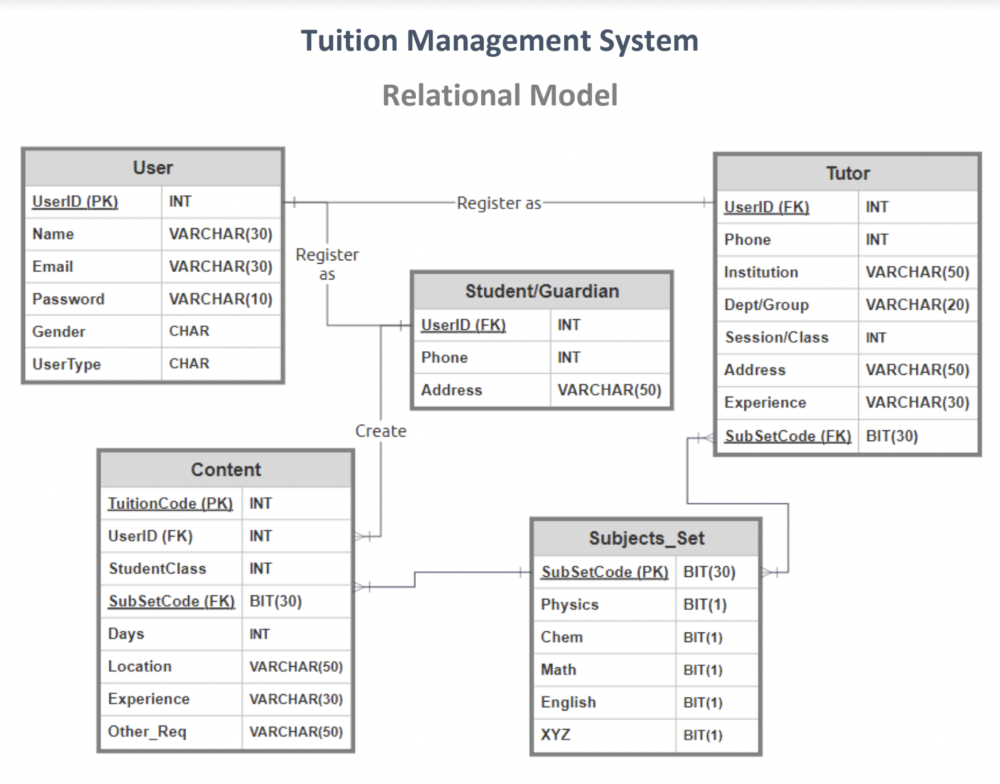

# Tuition-Management-System
### Web platform

## Overview

It’s a Management System that helps students or the guardians to
find appropriate tutors.
Tutors can be appointed through our system
easily without any commission.

### Expected Timeline
-----------------

### Relational Model for Database

  

### ER diagram for Database

  

Technologies 
----------------------------------
Tools | Description 
--------------|:------------|
MySQL | For Database Management System 
MS sql Server | For storing & controling Database
Javascript | Programming language
HTML and CSS | Web design
NodeJS | For Backend
Docker, Azure VS | For access database
VS Code | IDE
